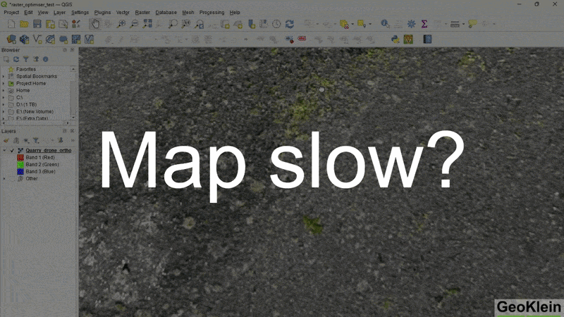
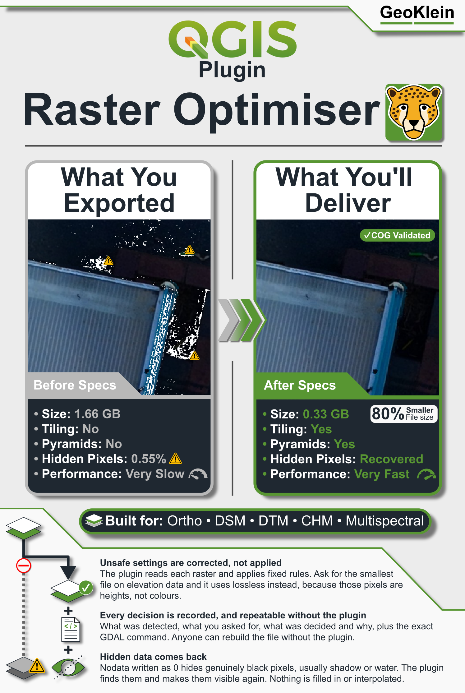
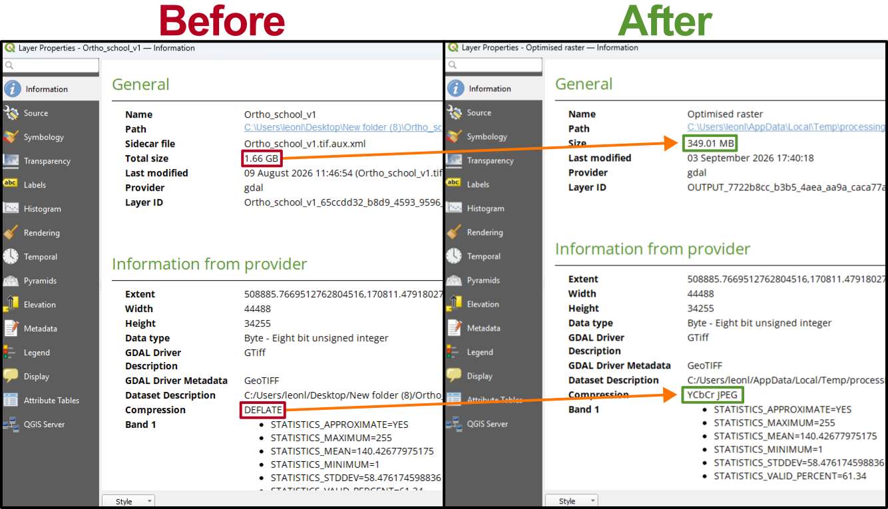
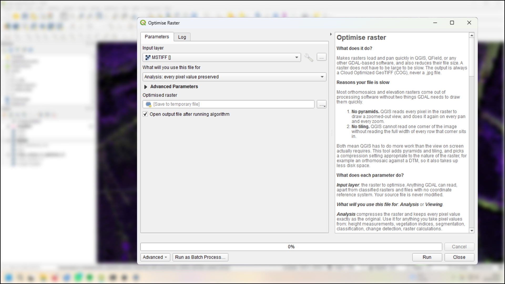
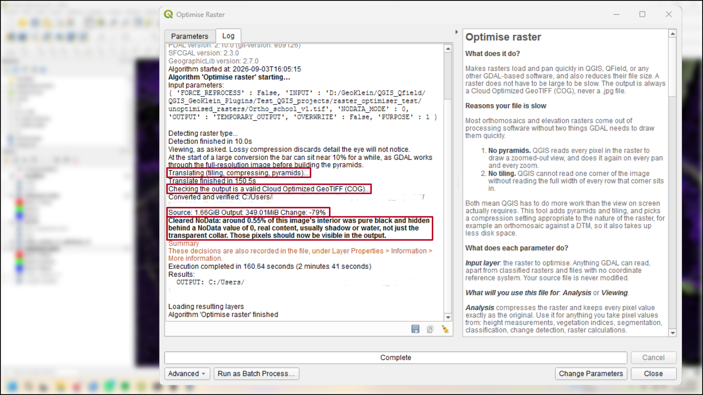
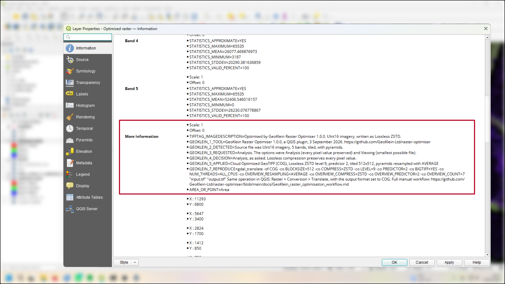

# Raster Optimiser

*Before, during and after: a slow raster, the plugin run, and the same file panning smoothly.*

*Why the tool exists: field and survey rasters are often slow to pan in
QGIS, and the fix is a set of GDAL settings that are easy to get wrong by
hand.*

A QGIS Processing plugin that converts slow, unoptimised orthomosaics,
elevation and multispectral rasters into fast-panning Cloud Optimized
GeoTIFFs (COGs) - the right tiling, pyramid and compression settings
applied automatically, no GDAL flags to memorise.

See `docs/GeoKlein_raster_optimisation_workflow.md` for the full workflow and
design notes.

*Source on the left and optimised output on the right, with the size and
compression fields marked.*

## How to use it

**Install.** From the QGIS Plugin Manager, once the plugin is listed on
plugins.qgis.org: Plugins, Manage and Install Plugins, then search for
GeoKlein Raster Optimiser. Until then, download the release zip
`raster_optimiser-1.0.0.zip` from
https://github.com/GeoKlein-Ltd/raster-optimiser/releases, then Plugins,
Manage and Install Plugins, Install from ZIP.

Do not use the green Code button's Download ZIP. It produces
`raster-optimiser-main.zip`, which nests the plugin one folder deep and
bundles the docs and tools, and QGIS cannot install it: the install fails
with ModuleNotFoundError. Use the Plugin Manager or the release zip above.

**Run.** Processing, Toolbox, GeoKlein, Optimise raster. Or the Raster menu,
GeoKlein Raster Optimiser, Optimise raster. Pick the input raster, choose
'Analysis' or 'Viewing', choose where to save the output, and run.

*The Optimise raster algorithm in the Processing Toolbox, with the input
raster, the 'Analysis' or 'Viewing' choice, and the output path.*

*The Log tab after a run, with the detection, profile decision and
end-of-run summary lines marked.*

*Layer Properties, Information: the GEOKLEIN_1 to GEOKLEIN_7 keys record
what was detected, what was decided, and the command that reproduces the
file.*

The output is always a real file on disk: an ordinary Cloud Optimized GeoTIFF
that opens in any software that can read GeoTIFFs. You can send it to a client
or put it on a server exactly as it is, with no separate export step. By
default it is written to a temporary location that QGIS may clear later, which
is why you should set a proper output path before you run.

Use that Processing algorithm, not the right-click Export, Save As in the
Layers panel. Save As is a separate QGIS tool that writes a plain GeoTIFF
with none of the tiling, pyramids or compression this plugin adds, so its
result is not the plugin's output and should not be judged as such.

## What to expect

Six things that look like problems and aren't.

**The output looks slightly different in colour.** On 16-bit and multispectral
imagery, QGIS calculates its own contrast stretch for each layer, and two
layers can end up with slightly different minimum and maximum values even when
their pixels are identical. Copy the symbology from one layer to the other and
the difference should disappear. To confirm the data is unchanged, compare the
band statistics in Layer Properties: they will match exactly.

**The output is larger than the source.** This happens when the source file
was already compressed and you chose 'Analysis', or when you chose 'Viewing'
on a file that was already compressed for viewing. If the source did not already
have pyramids, building them adds roughly a third to the base image size. If
it already had pyramids, the increase instead comes from the compression
change or from restructuring the file into a valid Cloud Optimized GeoTIFF.
Either way, this is the cost of the speed improvement: the file is faster to
pan, not smaller.

**The output has slightly different georeferencing text.** Some files store
their CRS as a BOUNDCRS: an EPSG code wrapped in a particular datum
transformation to WGS 84. GDAL does not keep that wrapper when it writes a
GeoTIFF, so the output carries the bare EPSG code instead. This is GDAL's
behaviour, not this plugin's: a plain gdal_translate with no options does the
same thing. The origin, pixel size and extent are byte-identical between
source and output. What changes is the datum transformation a later consumer
uses when it reprojects, because it now picks one itself rather than following
the one named in the file. That shift is usually small, but how small depends
entirely on which transformation was dropped, and for some files it is larger.
To check your own case, open the source and the output together, reproject
both to WGS 84 or a web basemap, and zoom in on a known point: any gap between
them is the difference between the two transformations. The bare EPSG code is
often the better default, since it lets PROJ choose the best transformation
for the area rather than a fixed one from the source software.

**Running the plugin on its own output.** If you take a file written for
viewing and run it again for analysis, the result will be substantially larger
with no gain in accuracy: the pixel values were already changed by the first
pass, and preserving them now keeps those changed values rather than recovering
the originals. If you run it again for viewing instead, the file is compressed
a second time rather than the first, so a little more detail is lost each
time, though pan and zoom speed stay the same either way. The plugin warns
when it detects either case. For measurement work, or for a clean copy, run it
on the original file instead.

**Running the plugin again with the same purpose on a file it already
optimised.** If you run the plugin a second time with the same purpose on a
file it has already converted, it will not redo the work silently. It stops
before converting and tells you the file is already tiled, has pyramids, is
already using the target compression, and is already a valid Cloud Optimized
GeoTIFF, so converting it again would not make it faster or smaller. To force
it anyway, tick "Reprocess even if already optimised" under Advanced
parameters.

**Running the plugin on a file optimised by an earlier version of the
plugin.** This version is the first to always write a genuine Cloud Optimized
GeoTIFF. A file from an earlier version can already be tiled, have pyramids,
and be on the target compression, and still not be a valid COG, because a COG
also requires the file's index to sit at the front rather than after the
image data. The plugin reprocesses it anyway, even without ticking Reprocess,
to add the missing structure. For a file that was written for viewing, this
means decoding and re-encoding the JPEG data, so the pixel values change
slightly, the same as running the plugin twice for viewing above. For any
other file, pan and zoom speed and file size stay about the same, and only
the byte layout changes.

## Licence

The source code is licensed under the GPL. The GeoKlein name and the cheetah
logo are not covered by that licence and remain the property of GeoKlein Ltd.
If you fork this plugin, please replace the branding - the code is yours to
use.

Not required, but very welcome: a credit back to GeoKlein, and a message
telling me what you're building. I'd genuinely like to see where this ends up.

Full license text: `LICENSE`. The name and logo carve-out is also recorded
in `NOTICE`, which ships alongside `LICENSE` in the plugin package. Keep the
two in step if either changes.

## Contact

- Email: mail@geoklein.com
- Issues: https://github.com/GeoKlein-Ltd/raster-optimiser/issues
